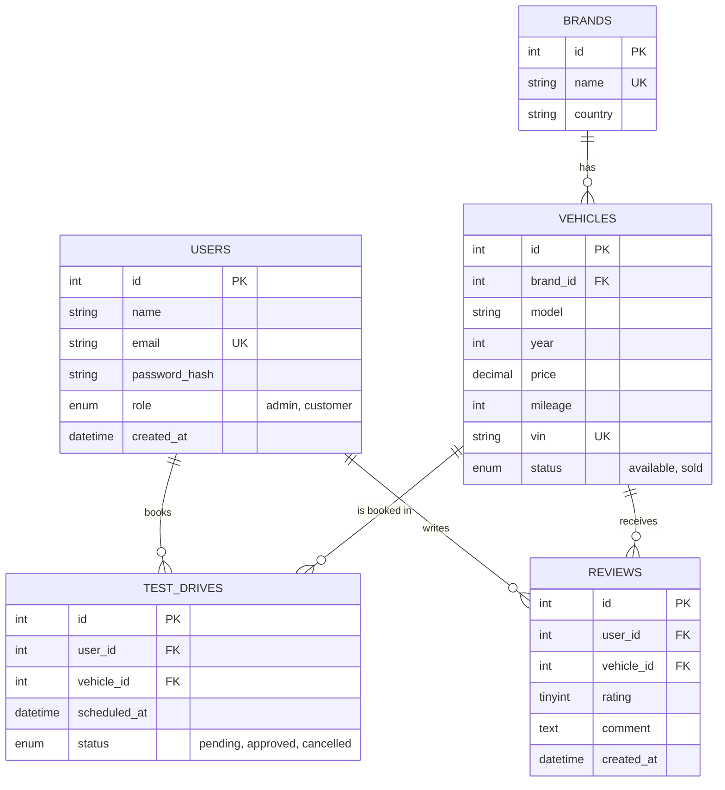

# Draft ERD (Milestone 1)

Planning only. No database exists yet (Milestone 2).

```mermaid
erDiagram
    USERS ||--o{ TEST_DRIVES : books
    USERS ||--o{ REVIEWS : writes
    BRANDS ||--o{ VEHICLES : has
    VEHICLES ||--o{ TEST_DRIVES : "is booked in"
    VEHICLES ||--o{ REVIEWS : receives

    USERS {
        int id PK
        string name
        string email UK
        string password_hash
        enum role "admin, customer"
        datetime created_at
    }
    BRANDS {
        int id PK
        string name UK
        string country
    }
    VEHICLES {
        int id PK
        int brand_id FK
        string model
        int year
        decimal price
        int mileage
        string vin UK
        enum status "available, sold"
    }
    TEST_DRIVES {
        int id PK
        int user_id FK
        int vehicle_id FK
        datetime scheduled_at
        enum status "pending, approved, cancelled"
    }
    REVIEWS {
        int id PK
        int user_id FK
        int vehicle_id FK
        tinyint rating
        text comment
        datetime created_at
    }
```
